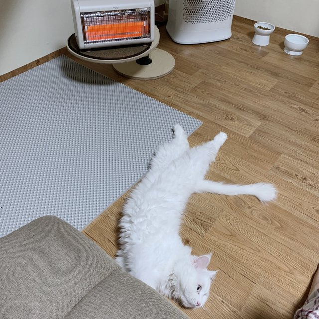

## 내일의 집

### 1.GNB

- 로그인을 하지 않은 경우

```html
<div class="button-group">
  <button
    class="gnb-icon-button is-search lg-hidden"
    type="button"
    aria-label="검색창 열기 버튼"
  >
    <i class="ic-search"></i>
  </button>
  <a
    class="gnb-icon-button is-cart"
    href="/"
    aria-label="장바구니 페이지로 이동"
  >
    <i class="ic-cart"></i
  ></a>
  <div class="gnb-auth sm-hidden">
    <a href="/">로그인</a>
    <a href="/">회원가입</a>
  </div>
</div>
```

- 로그인을 했을 경우

```html
<div class="button-group">
  <button
    class="gnb-icon-button is-search lg-hidden"
    type="button"
    aria-label="검색창 열기 버튼"
  >
    <i class="ic-search"></i>
  </button>

  <a
    class="gnb-icon-button sm-hidden"
    href="/"
    aria-label="스크랩북 페이지로 이동"
  >
    <i class="ic-bookmark"></i
  ></a>

  <a
    class="gnb-icon-button sm-hidden"
    href="/"
    aria-label="내소식 페이지로 이동"
  >
    <i class="ic-bell"></i
  ></a>

  <a
    class="gnb-icon-button is-cart"
    href="/"
    aria-label="장바구니 페이지로 이동"
  >
    <i class="ic-cart"></i><strong class="badge">5</strong></a
  >

  <button
    class="gnb-avatar-button sm-hidden"
    type="button"
    aria-label="마이메뉴 열기 버튼"
  >
    <div class="avatar-32">
      
    </div>
  </button>
</div>
```

### 2. Sidebar

- 로그인을 하지 않은 경우

```html
<div class="sidebar-auth">
  <a class="btn-outlined btn-40" href="/">로그인</a>
  <a class="btn-primary btn-40" href="/">회원가입</a>
</div>
```

- 로그인을 했을 경우

```html
<div class="sidebar-user">
  <a href="/">
    <div class="avatar-24">
      
    </div>
    <strong class="username">USER</strong></a
  >
</div>
```

### 3. Review

- 리뷰가 1개 이상 일 경우

```html
<section
  class="product-section product-review"
  id="product-review"
  role="tabpanel"
>
  <header class="product-section-header">
    <h1 class="title">리뷰</h1>
    <strong class="badge" aria-label="566개">566</strong>
    <a class="text-button" href="/">리뷰쓰기</a>
  </header>

  <div class="product-section-content">
    <div class="review-scoreboard">
      <div class="score-summary">
        <strong class="average-score">4.2</strong>
        <div class="star-rating">
          <i class="ic-star is-active"></i><i class="ic-star is-active"></i
          ><i class="ic-star is-active"></i><i class="ic-star is-active"></i
          ><i class="ic-star"></i>
        </div>
      </div>

      <div class="score-detail">
        <dl class="score-stats-list">
          <div class="score-stats-item is-active">
            <dt>5점</dt>
            <dd>
              <div class="bar-graph" aria-hidden>
                <div class="active-bar"></div>
              </div>
              <strong class="count">467</strong>
            </dd>
          </div>

          <div class="score-stats-item">
            <dt>4점</dt>
            <dd>
              <div class="bar-graph" aria-hidden>
                <div class="active-bar"></div>
              </div>
              <strong class="count">87</strong>
            </dd>
          </div>

          <div class="score-stats-item">
            <dt>3점</dt>
            <dd>
              <div class="bar-graph" aria-hidden>
                <div class="active-bar"></div>
              </div>
              <strong class="count">13</strong>
            </dd>
          </div>

          <div class="score-stats-item">
            <dt>2점</dt>
            <dd>
              <div class="bar-graph" aria-hidden>
                <div class="active-bar"></div>
              </div>
              <strong class="count">0</strong>
            </dd>
          </div>

          <div class="score-stats-item">
            <dt>1점</dt>
            <dd>
              <div class="bar-graph" aria-hidden>
                <div class="active-bar"></div>
              </div>
              <strong class="count">0</strong>
            </dd>
          </div>
        </dl>
      </div>
    </div>

    <ol class="review-list">
      <li class="review-item">
        <article class="review-card">
          <header class="review-card-header">
            <h3 class="visually-hidden">김수정님이 작성한 리뷰</h3>

            <a class="avatar-24" href="/">
              
            </a>

            <div class="info">
              <a class="username" href="/">
                <strong>김수정</strong>
              </a>

              <div class="detail">
                <div class="star-rating-13">
                  <i class="ic-star is-active"></i
                  ><i class="ic-star is-active"></i
                  ><i class="ic-star is-active"></i
                  ><i class="ic-star is-active"></i
                  ><i class="ic-star is-active"></i>
                </div>

                <div class="misc">
                  <time datetime="2022-01-01">2022.01.01</time>
                  <span>오늘의집 구매</span>
                </div>
              </div>
            </div>
          </header>

          <div class="review-card-body">
            <p>
              집 전체를 데운다기보다는 틀어놓고 앞에 앉아있으면 따땃해지는
              정도예요. 불 꺼놓고 난로 켜고 담요 덮은 채로 커피 마시면 아주
              좋아요! 고양이도 좋아해요.
            </p>
          </div>

          <footer class="review-card-footer">
            <button class="btn-outlined btn-32" type="button">
              도움이 돼요.
            </button>
            <p>
              <strong><span>7</span>명</strong>에게 도움이 되었습니다.
            </p>
          </footer>
        </article>
      </li>

      <!-- NOTE : 사용자가 도움됨을 체크, 도움됨 +1 -->
      <li class="review-item">
        <article class="review-card">
          <header class="review-card-header">
            <h3 class="visually-hidden">pinkpig님이 작성한 리뷰</h3>

            <a class="avatar-24" href="/">
              
            </a>

            <div class="info">
              <a class="username" href="/">
                <strong>pinkpig</strong>
              </a>

              <div class="detail">
                <div class="star-rating-13">
                  <i class="ic-star is-active"></i
                  ><i class="ic-star is-active"></i><i class="ic-star"></i
                  ><i class="ic-star"></i><i class="ic-star"></i>
                </div>

                <div class="misc">
                  <time datetime="2022-01-01">2022.01.01</time>
                  <span>오늘의집 구매</span>
                </div>
              </div>
            </div>
          </header>

          <div class="review-card-body">
            <p>
              오래된 아파트라 외풍이 심하게 드는 방이에요. 급하게 구매했는데
              예약배송이라 거의 10일정도 기다린거 같네요. 배송이 늦은만큼 기대도
              컷는데 제 방이 큰 편이라 전체가 따뜻해지는 정도는 아니였고, 하지만
              틀어놓으면 확실히 방 공기가 달라지긴 합니다. 올겨울은 떨지않고
              보낼 수 있을 것 같네요~ 감사합니다.
            </p>
          </div>

          <footer class="review-card-footer">
            <button class="btn-primary btn-32" type="button">
              <i class="ic-check" aria-hidden></i>
              도움됨
            </button>
            <p>
              <strong><span>1</span>명</strong>에게 도움이 되었습니다.
            </p>
          </footer>
        </article>
      </li>

      <!-- NOTE : 유저 이미지가 없는 경우 -->
      <li class="review-item">
        <article class="review-card">
          <header class="review-card-header">
            <h3 class="visually-hidden">우유파이님이 작성한 리뷰</h3>

            <a class="avatar-24" href="/"> </a>

            <div class="info">
              <a class="username" href="/">
                <strong>우유파이</strong>
              </a>

              <div class="detail">
                <div class="star-rating-13">
                  <i class="ic-star is-active"></i
                  ><i class="ic-star is-active"></i
                  ><i class="ic-star is-active"></i><i class="ic-star"></i
                  ><i class="ic-star"></i>
                </div>

                <div class="misc">
                  <time datetime="2022-01-01">2022.01.01</time>
                  <span>오늘의집 구매</span>
                </div>
              </div>
            </div>
          </header>

          <div class="review-card-body">
            <p>
              작업실에서 손이 시려워서 책상 위에 올려서 쓸걸로 골랐습니다!
              아주아주 뜨듯하고 크기도 적당하고 민트 사고싶었지만 품절ㅠㅠ
            </p>
          </div>

          <footer class="review-card-footer">
            <button class="btn-outlined btn-32" type="button">
              도움이 돼요.
            </button>
            <p>
              <strong><span>3</span>명</strong>에게 도움이 되었습니다.
            </p>
          </footer>
        </article>
      </li>

      <!-- NOTE : 유저가 리뷰 이미지를 올린 경우 -->
      <li class="review-item">
        <article class="review-card">
          <header class="review-card-header">
            <h3 class="visually-hidden">육회먹고싶다님이 작성한 리뷰</h3>

            <a class="avatar-24" href="/">
              
            </a>

            <div class="info">
              <a class="username" href="/">
                <strong>육회먹고싶다</strong>
              </a>

              <div class="detail">
                <div class="star-rating-13">
                  <i class="ic-star is-active"></i
                  ><i class="ic-star is-active"></i
                  ><i class="ic-star is-active"></i
                  ><i class="ic-star is-active"></i><i class="ic-star"></i>
                </div>

                <div class="misc">
                  <time datetime="2022-01-01">2022.01.01</time>
                  <span>오늘의집 구매</span>
                </div>
              </div>
            </div>
          </header>

          <div class="review-card-body">
            <div class="review-image">
              
            </div>
            <p>
              섬세한 온도조절이 안 되는게 아쉽지만, 이 가격 이 디자인이면 완전
              만족 할 수 밖에없답니다:) 잘쓰고있어요!
            </p>
          </div>

          <footer class="review-card-footer">
            <button class="btn-outlined btn-32" type="button">
              도움이 돼요.
            </button>
            <p>
              <strong><span>7</span>명</strong>에게 도움이 되었습니다.
            </p>
          </footer>
        </article>
      </li>

      <!-- NOTE : 사용자가 도움됨을 미체크, 도움됨 X -->
      <li class="review-item">
        <article class="review-card">
          <header class="review-card-header">
            <h3 class="visually-hidden">노제님이 작성한 리뷰</h3>

            <a class="avatar-24" href="/">
              
            </a>

            <div class="info">
              <a class="username" href="/">
                <strong>노제</strong>
              </a>

              <div class="detail">
                <div class="star-rating-13">
                  <i class="ic-star is-active"></i
                  ><i class="ic-star is-active"></i
                  ><i class="ic-star is-active"></i
                  ><i class="ic-star is-active"></i
                  ><i class="ic-star is-active"></i>
                </div>

                <div class="misc">
                  <time datetime="2022-01-01">2022.01.01</time>
                  <span>오늘의집 구매</span>
                </div>
              </div>
            </div>
          </header>

          <div class="review-card-body">
            <p>가격 대비 만족합니다.</p>
          </div>

          <footer class="review-card-footer">
            <button class="btn-outlined btn-32" type="button">
              도움이 돼요.
            </button>
          </footer>
        </article>
      </li>
    </ol>

    <div class="pagination">
      <ol class="page-list">
        <li class="page-item is-active"><a href="/">1</a></li>
        <li class="page-item"><a href="/">2</a></li>
        <li class="page-item"><a href="/">3</a></li>
        <li class="page-item"><a href="/">4</a></li>
        <li class="page-item"><a href="/">5</a></li>
      </ol>
      <button class="page-control page-next" type="button">
        <i class="ic-chevron"></i>
      </button>
    </div>
  </div>
</section>
<div class="product-section-divider sm-only" aria-hidden></div>
```

- 리뷰가 0개일 경우

```html
<section
  class="product-section product-review"
  id="product-review"
  role="tabpanel"
>
  <header class="product-section-header">
    <h1 class="title">리뷰</h1>
    <strong class="badge" aria-label="0개">0</strong>
    <a class="text-button" href="/">리뷰쓰기</a>
  </header>

  <div class="product-section-content">
    <p class="review-empty">
      첫 리뷰를 남겨주세요!<br />
      최대 <strong>500P</strong>를 드립니다.
    </p>
  </div>
</section>
<div class="product-section-divider sm-only" aria-hidden></div>
```
